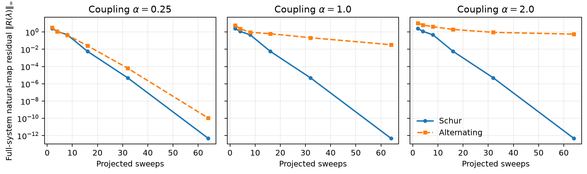

# DVI bilateral–unilateral coupling evaluation

## Conclusion

At equal projected-sweep count, eliminating the bilateral block before solving
the unilateral problem is both more accurate and faster than alternating the
two blocks. The advantage grows with coupling strength. In a fallen Unitree G1
with both hands and both feet on the ground, the Schur formulation reduced
sideways drift by **13×**, the median complementarity residual by **230×**, and
frame time by **2×**.

## Why block elimination helps

For bilateral impulses \(\lambda_b\) and unilateral impulses \(\lambda_u\),
the linearized constraint velocity is

$$
\begin{bmatrix}v_b\\v_u\end{bmatrix} =
\begin{bmatrix}D_{bb}&D_{bu}\\D_{ub}&D_{uu}\end{bmatrix}
\begin{bmatrix}\lambda_b\\\lambda_u\end{bmatrix} +
\begin{bmatrix}b_b\\b_u\end{bmatrix},
$$

with \(v_b=0\) and
\(0\leq\lambda_u\perp v_u\geq0\). Eliminating \(\lambda_b\) gives the exact
reduced operator

$$
S = D_{uu} - D_{ub}D_{bb}^{-1}D_{bu}.
$$

The implementation factors \(D_{bb}\) once and applies its inverse by forward
and backward substitution. It does not form a matrix inverse. Alternation uses
the same factorization, but information between the two blocks advances only
once per outer iteration. Schur elimination incorporates that response in every
projected unilateral update.

## Controlled problem with an exact solution

The synthetic benchmark constructs

$$
D_{bu}=D_{bb}C,\qquad
D_{uu}=S+C^TD_{bb}C,
$$

where \(D_{bb}\) and \(S\) are symmetric positive definite and the entries of
\(C\) scale with a coupling parameter \(\alpha\). Therefore

$$
\begin{bmatrix}x\\y\end{bmatrix}^{T}D
\begin{bmatrix}x\\y\end{bmatrix}
=(x+Cy)^TD_{bb}(x+Cy)+y^TSy>0,
$$

so the full problem is strictly convex. A mixed active/inactive KKT solution is
prescribed first and \(b\) is derived from it. This provides an exact reference
for impulse error and avoids judging either method by its own reduced equations.

Both methods start at zero and receive the same number of projected
Gauss–Seidel sweeps. Residuals are evaluated in the original full system using
the natural map

$$
R(\lambda_u)=\lambda_u-\Pi_{\mathbb{R}_+}
(\lambda_u-v_u).
$$



After 64 projected sweeps:

| Coupling \(\alpha\) | Schur \(\lVert R\rVert_\infty\) | Alternating \(\lVert R\rVert_\infty\) | Schur relative impulse error | Alternating relative impulse error |
|---:|---:|---:|---:|---:|
| 0.25 | 4.83e-13 | 1.07e-10 | 2.26e-14 | 6.33e-12 |
| 1.00 | 4.80e-13 | 3.37e-2 | 2.91e-14 | 2.43e-3 |
| 2.00 | 4.80e-13 | 5.70e-1 | 4.60e-14 | 7.51e-2 |

The reduced operator \(S\) is held fixed, so Schur convergence is independent
of \(\alpha\). Alternating convergence degrades as the off-diagonal coupling
grows. This isolates the mechanism relevant to articulated systems with several
simultaneous contacts.

## Fallen-G1 measurement

The G1 starts 0.2 m above the plane with a deterministic 20° pitch about global
Y. The fall is along X; displacement along Y is therefore sideways drift. The
script requires simultaneous hand-and-foot ground contact and records the body
labels, so a run cannot silently measure the standing phase.

The model, collision pipeline, friction, warm start, timestep, direct bilateral
solver, eight outer iterations, and two projected sweeps per iteration are
identical. Both methods use the same preconditioned projected diagonal
\(\lvert D_{ii}\rvert P_i^2\). Only the coupling schedule changes. Drift is
measured after 60 frames of settling following the first hand-and-foot contact.
Timing uses five 20-frame synchronized trials after the contact-rich rollout.

| Metric | Schur | Alternating | Alternating / Schur |
|---|---:|---:|---:|
| Sideways pelvis drift | **0.150 mm** | 1.925 mm | **12.8×** |
| Horizontal pelvis drift | **0.249 mm** | 2.508 mm | **10.1×** |
| Fitted sideways speed | **0.0476 mm/s** | 0.542 mm/s | **11.4×** |
| Post-contact median \(r_c\) | **9.44e-6** | 2.17e-3 | **230×** |
| Post-contact p95 \(r_c\) | **1.34e-4** | 1.76e-1 | **1,311×** |
| Median frame time | **67.35 ms** | 133.74 ms | **1.99×** |

Both runs reached left/right hand and left/right foot contact at frame 44 or
earlier. Measurements were made on an NVIDIA GeForce RTX 3080 Laptop GPU with
Newton 1.6.0.dev0 and Warp 1.17.0. Timing is hardware-specific; residual and
drift comparisons are the primary accuracy evidence. Frame time is an
end-to-end measurement: contact counts diverge with the trajectories, so it is
not a frozen-matrix microbenchmark.

The comparison was repeated with the historical relaxation \(\omega=1.0\),
instead of the branch default \(\omega=1.2\):

| \(\omega=1.0\) metric | Schur | Alternating |
|---|---:|---:|
| Sideways pelvis drift | **0.002 mm** | 2.338 mm |
| Horizontal pelvis drift | **0.127 mm** | 2.563 mm |
| Fitted sideways speed | **0.0020 mm/s** | 0.574 mm/s |
| Post-contact median \(r_c\) | **4.81e-6** | 2.14e-3 |
| Median frame time | **67.37 ms** | 132.56 ms |

The near-zero Schur lateral displacement makes a ratio poorly conditioned, so
absolute values are reported. The conclusion does not depend on the relaxation
change.

The aggregate solver convergence flag is true for 5% of frames for both
methods, mainly because the absolute bilateral residual remains near 6e-3 while
the configured tolerance is 1e-5. The table therefore makes the narrower,
testable claim of better error reduction under a fixed work budget; it does not
claim that every frame reaches the configured tolerance.

## Reproduction

From the repository root:

```bash
uv run python scripts/evaluate_dvi_block_convergence.py \
  --output block.json \
  --plot block.png

uv run python scripts/evaluate_kamino_dvi_coupling.py \
  --method both \
  --omega 1.2 \
  --frames 240 \
  --timing-frames 20 \
  --timing-trials 5 \
  --output g1.json
```

The controlled benchmark uses NumPy and is deterministic. The G1 benchmark
requires a CUDA device and accepts `--device`. Both emit complete run
configuration and machine-readable metrics. Reference outputs are stored in
[`docs/_static/dvi_block_coupling_reference.json`](docs/_static/dvi_block_coupling_reference.json)
and
[`docs/_static/dvi_g1_coupling_reference.json`](docs/_static/dvi_g1_coupling_reference.json).
The historical-relaxation repeat is stored in
[`docs/_static/dvi_g1_coupling_reference_omega_1_0.json`](docs/_static/dvi_g1_coupling_reference_omega_1_0.json).
