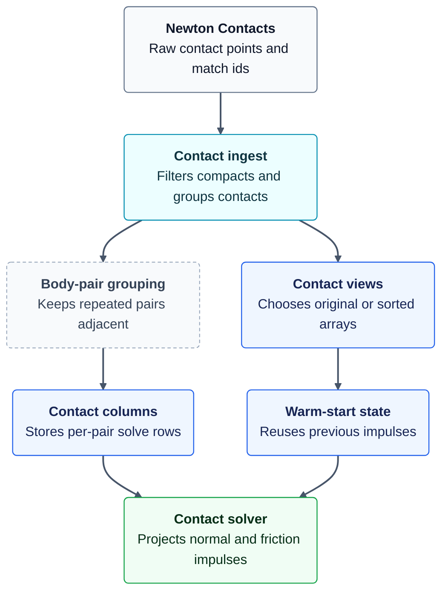
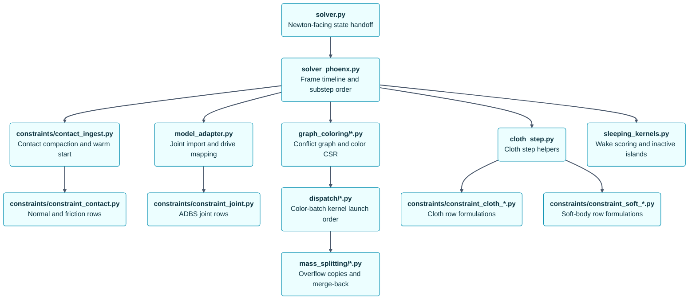
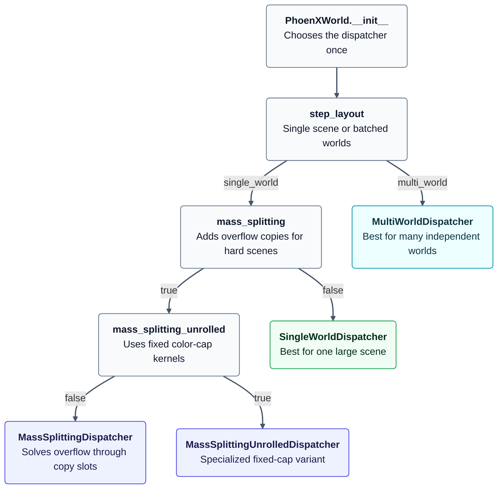

# PhoenX Solver Internals

PhoenX is Newton's deterministic, maximal-coordinate, CUDA-oriented PGS/TGS solver for rigid bodies, joints, contacts, cloth triangles/bending, and soft-body constraints. It is built to handle both very large single worlds and many independent small worlds without changing the constraint model. This note is for people changing the solver; it gives the mental model before you open the large kernel files.

For tuning history, use [`PERF_NOTES.md`](PERF_NOTES.md). For compound contact grouping design notes, use [`CONTACT_GROUP_COMPOUND_OPT.md`](CONTACT_GROUP_COMPOUND_OPT.md).

## 1. Why PhoenX Exists
PhoenX is designed for scenes where the hard part is not just solving constraints, but solving changing constraint graphs repeatably, at high stiffness, and at high throughput.
1. **Deterministic execution**: stable constraint ids, deterministic coloring, fixed dispatcher choices, and graph-stable object bindings keep identical inputs on the same solver path.
2. **Two optimized scale regimes**: single-world schedulers target huge worlds with large stacks or dense deformables; multi-world schedulers target many small independent worlds, such as robot and RL batches.
3. **Dynamic graph coloring**: active rows are recolored from current contacts, constraints, and wake state instead of relying on a precomputed graph that goes stale.
4. **Substep-first stiffness**: the TGS-soft path favors smaller substeps, warm start, contact-anchor reuse, soft constraints, and bias-off relaxation so stiff contacts and joints converge without a heavy global solve.
5. **Contact jitter control**: accumulated impulse clamping, warm-start carryover, and relaxation remove much of the energy that naive bias terms inject into resting stacks.
6. **Momentum-preserving mass splitting**: Tonge-style mass splitting caps regular colors, spills dense conflicts into copy states, scales effective mass per slot, and averages/broadcasts back without inventing net impulse.
7. **Maximal-coordinate constraints**: joints and contacts are solved directly in world coordinates, so closed loops do not have to be forced into an acyclic articulation tree.
8. **Unified constraint core**: impulse-style rigid constraints and position-level cloth/soft-body constraints share the same row pipeline, coloring, scheduling, and state-access rules.
9. **Native deformable support**: cloth and soft bodies emit real PhoenX rows at the deepest solver level; they are not a post-step correction patched onto a rigid solver.
```mermaid
flowchart TD
    classDef public fill:#f8fafc,stroke:#64748b,stroke-width:1.2px,color:#0f172a
    classDef core fill:#ecfeff,stroke:#0891b2,stroke-width:1.6px,color:#0e3440
    classDef graph fill:#eef2ff,stroke:#4f46e5,stroke-width:1.2px,color:#1e1b4b
    classDef solve fill:#f0fdf4,stroke:#16a34a,stroke-width:1.2px,color:#052e16
    classDef data fill:#eff6ff,stroke:#2563eb,stroke-width:1.2px,color:#172554
    A("<b>Deterministic runtime</b><br/>Keeps replay on the same row path"):::public
    B("<b>Dynamic coloring</b><br/>Recolors active constraints every step"):::graph
    C("<b>Scheduler family</b><br/>Targets huge scenes and batched worlds"):::solve
    M("<b>Momentum-safe mass splitting</b><br/>Parallel overflow without extra impulse"):::solve
    D("<b>Maximal coordinates</b><br/>Keeps closed loops as constraints"):::public
    E("<b>Unified row model</b><br/>Shares one pipeline across constraint types"):::data
    F("<b>Native deformables</b><br/>Makes cloth and soft bodies first-class rows"):::data
    G("<b>Execution model</b><br/>Predictable work with layout-specific kernels"):::core
    H("<b>Constraint model</b><br/>One formulation for rigid and deformable rows"):::core
    I("<b>PhoenX solve core</b><br/>Warm start, solve, relax, integrate"):::core
    J("<b>Practical result</b><br/>Stiff stable scenes at very different scales"):::solve
    A --> B
    B --> C
    C --> M
    M --> G
    D --> E
    E --> F
    F --> H
    G --> I
    H --> I
    I --> J
    linkStyle 0 stroke:#475569,stroke-width:2px
    linkStyle 1 stroke:#475569,stroke-width:2px
    linkStyle 2 stroke:#475569,stroke-width:2px
    linkStyle 3 stroke:#475569,stroke-width:2px
    linkStyle 4 stroke:#475569,stroke-width:2px
    linkStyle 5 stroke:#475569,stroke-width:2px
    linkStyle 6 stroke:#475569,stroke-width:2px
    linkStyle 7 stroke:#475569,stroke-width:2px
    linkStyle 8 stroke:#475569,stroke-width:2px
    linkStyle 9 stroke:#475569,stroke-width:2px
```

## 2. Influences And Credits
PhoenX is an implementation, not a paper. These links name the ideas and prior systems that map directly to implementation vocabulary in this folder.
- [Solver2D](https://box2d.org/posts/2024/02/solver2d/) by Erin Catto is the closest design note for the PGS/TGS-soft vocabulary used here: warm starting, accumulated impulse clamping, substep contact-anchor updates, soft constraints, and relaxation.
- [Small Steps in Physics Simulation](https://mmacklin.com/smallsteps.pdf) motivates the small-substep approach for stiff local solvers: many simple substeps can beat one large step with more iterations for constraint error and damping.
- [PhysX TGS documentation](https://nvidiagameworks.github.io/PhysX/4.1/documentation/physxguide/Manual/RigidBodyDynamics.html#temporal-gauss-seidel) is the source for the Temporal Gauss-Seidel name and for the practical goals PhoenX also targets: convergence, high mass-ratio handling, lower correction energy, and joint-drive accuracy.
- [PhysX SDK](https://github.com/NVIDIA-Omniverse/PhysX) also influenced local details such as material combine behavior, soft/deformable formulations, and the cloth bending model referenced in constraint modules.
- [Richard Tonge's mass-splitting paper](https://dl.acm.org/doi/pdf/10.1145/2185520.2185601) is the source of the bounded-color overflow path: per-node/per-partition copy states, Tonge inverse-mass factors, momentum-preserving average/broadcast, and writeback.

## 3. One Step At A Glance
Read this first when debugging ordering issues. The key contract is the TGS-soft order inside each substep: biased solve, integrate, bias-off relax.
```mermaid
flowchart TD
    classDef public fill:#f8fafc,stroke:#64748b,stroke-width:1.2px,color:#0f172a
    classDef core fill:#ecfeff,stroke:#0891b2,stroke-width:1.6px,color:#0e3440
    classDef graph fill:#eef2ff,stroke:#4f46e5,stroke-width:1.2px,color:#1e1b4b
    classDef solve fill:#f0fdf4,stroke:#16a34a,stroke-width:1.2px,color:#052e16
    classDef note fill:#f8fafc,stroke:#94a3b8,stroke-dasharray:4 3,color:#334155
    A("<b>SolverPhoenX</b><br/>Imports state forces and controls"):::public
    B("<b>PhoenXWorld.step</b><br/>Owns the frame timeline"):::core
    C("<b>Contact ingest</b><br/>Makes contacts compact and warm-startable"):::core
    D("<b>Active row graph</b><br/>Turns constraints into safe batches"):::graph
    E("<b>Kinematics and sleeping</b><br/>Updates targets and active islands"):::core
    F("<b>Dispatcher setup</b><br/>Prepares the chosen solve path"):::solve
    N("<b>Substep loop</b><br/>Repeats the stable TGS order"):::note
    G("<b>Forces and gravity</b><br/>Adds external acceleration"):::core
    H("<b>Biased solve</b><br/>Pushes positions toward constraints"):::solve
    I("<b>Integrate positions</b><br/>Advances bodies and particles"):::core
    J("<b>Relax solve</b><br/>Cleans velocity after integration"):::solve
    K("<b>Recover state</b><br/>Refreshes particle and body caches"):::core
    L("<b>Export state_out</b><br/>Writes Newton-visible results"):::public
    A --> B
    B --> C
    C --> D
    D --> E
    E --> F
    F --> N
    N --> G
    G --> H
    H --> I
    I --> J
    J --> N
    J --> K
    K --> L
    linkStyle 0 stroke:#475569,stroke-width:2px
    linkStyle 1 stroke:#475569,stroke-width:2px
    linkStyle 2 stroke:#475569,stroke-width:2px
    linkStyle 3 stroke:#475569,stroke-width:2px
    linkStyle 4 stroke:#475569,stroke-width:2px
    linkStyle 5 stroke:#475569,stroke-width:2px
    linkStyle 6 stroke:#475569,stroke-width:2px
    linkStyle 7 stroke:#475569,stroke-width:2px
    linkStyle 8 stroke:#475569,stroke-width:2px
    linkStyle 9 stroke:#475569,stroke-width:2px
    linkStyle 10 stroke:#475569,stroke-width:2px
    linkStyle 11 stroke:#475569,stroke-width:2px
    linkStyle 12 stroke:#475569,stroke-width:2px
```

## 4. State And Rows
`ConstraintContainer` and contact columns describe rows; body/particle containers hold the mutable state those rows read and write.
```mermaid
flowchart TD
    classDef row fill:#eff6ff,stroke:#2563eb,stroke-width:1.2px,color:#172554
    classDef graph fill:#eef2ff,stroke:#4f46e5,stroke-width:1.2px,color:#1e1b4b
    classDef state fill:#ecfeff,stroke:#0891b2,stroke-width:1.2px,color:#0e3440
    classDef solve fill:#f0fdf4,stroke:#16a34a,stroke-width:1.2px,color:#052e16
    R("<b>Row descriptions</b><br/>Keep metadata and warm-start impulses"):::row
    E("<b>ElementInteractionData</b><br/>Connects each row to touched state"):::graph
    CSR("<b>Color CSR</b><br/>Orders rows for race-free launches"):::graph
    K("<b>Solver kernels</b><br/>Prepare project and relax constraints"):::solve
    Live("<b>Live state</b><br/>Mutable body and particle data"):::state
    Copy("<b>Overflow state</b><br/>Copy slots that preserve net impulse"):::state
    R --> E
    E --> CSR
    CSR --> K
    K --> Live
    K -.->|mass-splitting overflow only| Copy
    Copy -.->|average + writeback| Live
    linkStyle 0 stroke:#475569,stroke-width:2px
    linkStyle 1 stroke:#475569,stroke-width:2px
    linkStyle 2 stroke:#475569,stroke-width:2px
    linkStyle 3 stroke:#475569,stroke-width:2px
    linkStyle 4 stroke:#475569,stroke-width:2px
    linkStyle 5 stroke:#475569,stroke-width:2px
```
Important details:
- PhoenX body slot `0` is the static world anchor in `SolverPhoenX`; Newton body `i` maps to PhoenX slot `i + 1`.
- Contact columns are per-step. `ContactContainer` follows per-contact index `k` and the match index, so warm-start state can survive column compaction.
- Mixed rigid/deformable scenes rely on `access_mode.py` to flip between velocity-level and position-level state. Those flips are correctness-critical.
- CUDA graph replay assumes stable object bindings. Allocate sentinel buffers instead of changing which arrays kernels receive mid-run.

## 5. Contact Path
Use this when debugging contacts, friction, body-pair grouping, cloth/soft contact endpoints, or contact warm-start drift.


## 6. Which File Should I Open?


## 7. Solver Layouts
The dispatcher is selected once in `PhoenXWorld.__init__`; this keeps the captured hot path free of broad capability branches.

| Mode | When it is used | Core idea |
| --- | --- | --- |
| `step_layout="single_world"` | A few large worlds, large stacks, mass splitting | Build one global color CSR. Dispatch persistent-grid head kernels plus a single-block fused tail for small trailing colors. |
| `step_layout="multi_world"` | Many independent worlds, robot/RL batches | Build per-world color CSR. Fast-tail or block-per-world schedulers process worlds in a graph-stable layout. |
| `mass_splitting=True` | Single-world scenes where color count or dense deformables would serialize too much | Cap regular colors, solve overflow with copy states, then average/broadcast and write back. |

Important knobs:
| Knob | Effect |
| --- | --- |
| `substeps` | Splits outer `dt`; more substeps improve stiffness/contact stability. |
| `solver_iterations` | Biased PGS sweeps per substep. |
| `velocity_iterations` | Bias-off relax sweeps per substep; `0` is valid. |
| `threads_per_world` | Multi-world lane count: `"auto"`, `8`, `16`, or `32`. |
| `prepare_refresh_stride` | Reuses cached rigid row prepare data for some substeps. Unsupported for deformables, sleeping, or mass splitting. |
| `sor_boost` | Multiplies per-row impulse updates. `1.0` is vanilla PGS; values near `2.0` are usually unstable. |
| `sleeping_velocity_threshold` | Enables island sleeping when positive. |

## 8. Minimal Public Usage
Internal tests may instantiate `PhoenXWorld` directly, but examples and docs should show the public solver.
```python
import warp as wp

import newton

builder = newton.ModelBuilder()
builder.add_ground_plane()

box = builder.add_body(
    xform=wp.transform(p=wp.vec3(0.0, 0.0, 0.5), q=wp.quat_identity()),
)
builder.add_shape_box(
    box,
    hx=0.1,
    hy=0.1,
    hz=0.1,
    cfg=newton.ModelBuilder.ShapeConfig(density=1000.0, mu=0.8),
)
builder.gravity = -9.81
model = builder.finalize()

solver = newton.solvers.SolverPhoenX(
    model,
    substeps=8,
    solver_iterations=16,
    velocity_iterations=1,
    step_layout="single_world",
)

state_0 = model.state()
state_1 = model.state()
control = model.control()
pipeline = newton.CollisionPipeline(model, contact_matching="sticky")
contacts = model.contacts(collision_pipeline=pipeline)

dt = 1.0 / 60.0
for _ in range(120):
    state_0.clear_forces()
    model.collide(state_0, contacts)
    solver.step(state_0, state_1, control, contacts, dt)
    state_0, state_1 = state_1, state_0
```
When sleeping is enabled and a body receives an external wrench before collision, wake it before broad phase:
```python
state_0.body_f.assign(user_forces)
solver.wake_on_external_input(state_0)
model.collide(state_0, contacts)
solver.step(state_0, state_1, control, contacts, dt)
```

## 9. Change Checklist
Use these checks before changing core flow:
- **New constraint type**: add the dword schema with the shared header, init kernel, prepare/iterate/relax funcs, element emission in `_constraints_to_elements_kernel`, cid offsets/capacity in `PhoenXWorld`, and focused `unittest` coverage.
- **New joint mapping**: update `model_adapter.py`, ADBS initialization, control writeback in `solver.py`, and D6/joint parity tests.
- **New contact data**: update ingest, `ContactViews`, `ContactContainer`, warm-start copy, and any body-pair grouping sort path.
- **New scheduler path**: add a dispatcher if it changes solve choreography. Keep constructor-time selection graph-stable and benchmark with locked clocks.
- **Mass splitting changes**: validate direct-storage and copy-state paths. Slot cache, access mode, momentum-preserving average/broadcast, and writeback must agree.
- **Performance changes**: record results in `PERF_NOTES.md` if the lesson is likely to matter later, including reverted experiments.

Good local checks:
```bash
uv run --extra dev -m newton.tests -k test_solver_phoenx
uv run --extra dev -m newton.tests -k test_graph_coloring
uv run --extra dev -m newton.tests -k test_soft_body_mass_splitting_determinism
uv run --extra dev -m newton.tests -k test_soft_body_mass_splitting_momentum
uvx pre-commit run -a
```
